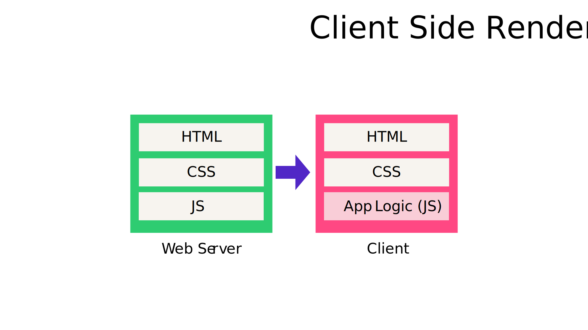

# Content Delivery Patterns in 2021

A Collection of solution patterns for \[web] content delivery.

## About

There is no perfect stack. There's always some risk mitigation and sacrifices to be made, and the decision is largely always going to be subjective. 

The stack isn't important, the ability to remain agile and adapt when it falls short is more important.

Day-0 choices are unlikely to be day-365 choices, and so on. Be willing to invest in something that will be thrown away to get a project to deliver value quickly. That value can be reinvested to evolve the underlying solution over time, but trying to make the perfect platform on day-0 is like trying to land a huge plane on a short runway.

Ops is key to survivability. 

## Index

1. [Static website](./StaticWebsite.md)

## Examples

