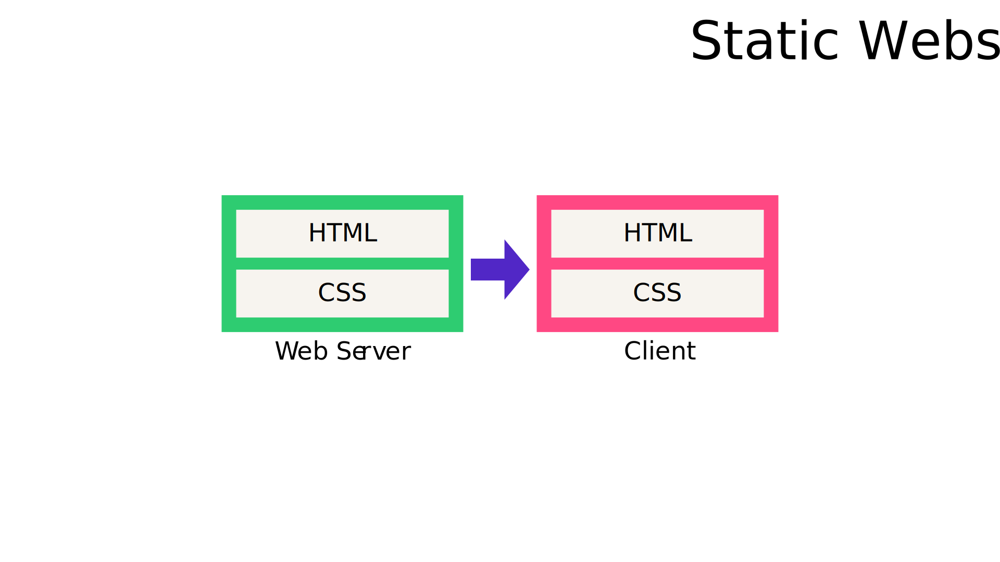

# Static Website

The fist, most classic, mode of content delivery is a static website. 

A Web Server simply serves a set of HTML, CSS, and Media -files - and all content is embedden in the HTML files themselves

## How To - in the Cloud Era

All major cloud vendors support this model

1. Put files to a file store, such as AWS S3
2. Expose the files through Static website hosting
3. DONE