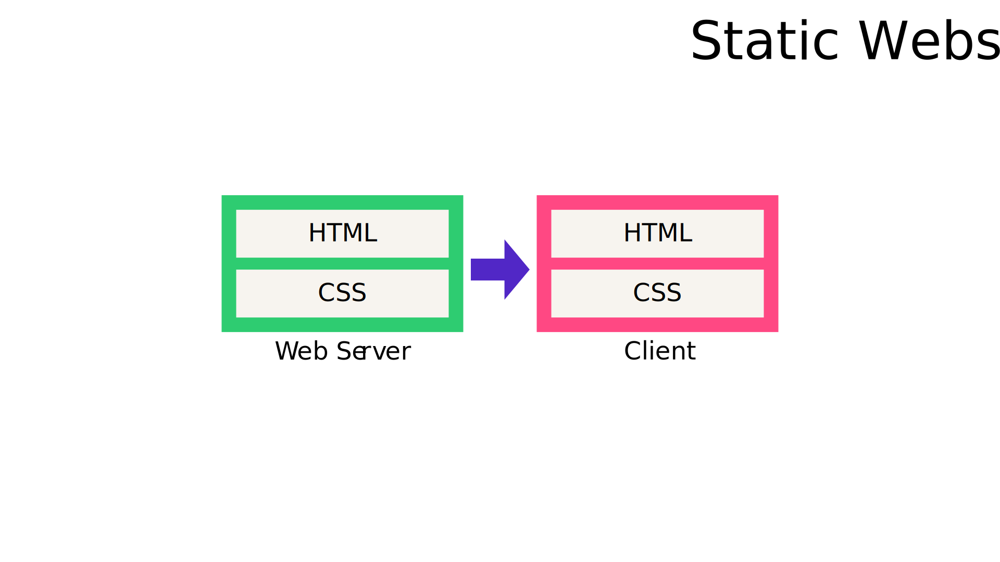

# Basic web site

The classic is just static html, css, and js, and media files from a web server

```ascii
 @ -> web-server -> static files

 [static files] --> (web server) --> @
```


# Classic Server Side Rendering (SSR)

```ascii
data --> business logic --> dynamic files -\
                                            +--> (web server) --> @                                          
static files ------------------------------/

```